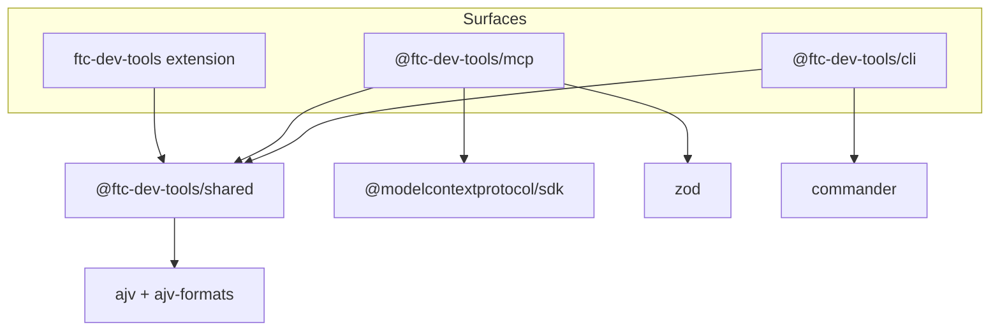
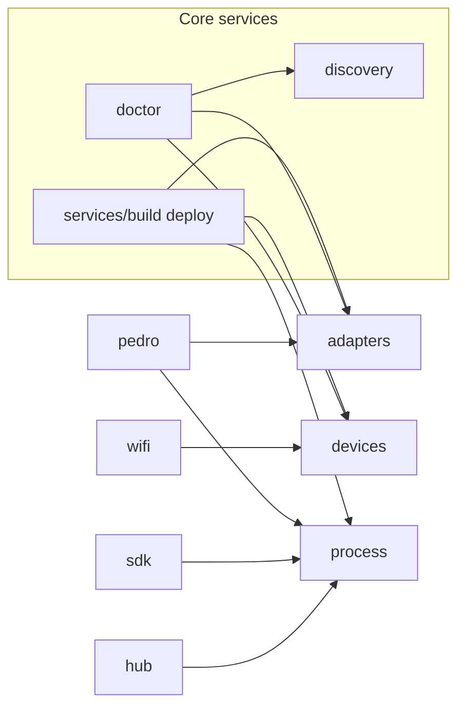

# Repository Inventory

Phase 1 inventory of the `ftc-dev-tools` monorepo as of version **0.1.0**, mapped to the Orchestrator v2 product taxonomy. See [coordination-ledger.md](./coordination-ledger.md) for phase status.

## Summary

FTC Dev Tools is a four-package npm workspace with a shared TypeScript core and three thin surfaces (CLI, VS Code extension, MCP). Robot code remains Java in user projects; this repository contains **no Java sources**. Integration with third-party libraries is ad hoc today (Pedro Pathing only).

## Package map

```text
ftc-dev-tools/
├── packages/
│   ├── shared/              @ftc-dev-tools/shared — core business logic
│   ├── cli/                   @ftc-dev-tools/cli — `ftc` executable
│   ├── mcp/                   @ftc-dev-tools/mcp — `ftc-mcp` stdio server
│   └── vscode-extension/      ftc-dev-tools — VS Code / Cursor UI
├── docs/                      VitePress documentation
├── examples/sample-ftc-project Minimal FTC-like layout for tests
└── scripts/                   Release, labels, issue automation
```

### npm workspace dependencies



| Package                     | Depends on           | External runtime tools            |
| --------------------------- | -------------------- | --------------------------------- |
| `@ftc-dev-tools/shared`     | ajv, ajv-formats     | adb, java, gradlew (user project) |
| `@ftc-dev-tools/cli`        | shared, commander    | same                              |
| `@ftc-dev-tools/mcp`        | shared, MCP SDK, zod | same                              |
| `ftc-dev-tools` (extension) | shared (bundled)     | same                              |

## Orchestrator taxonomy mapping

### Core Platform (`packages/shared/src/`)

| Module          | Responsibility                                                  |
| --------------- | --------------------------------------------------------------- |
| `adapters/`     | `OfficialFtcProjectAdapter` — project detection and inspection  |
| `config/`       | `.ftc-dev.json` load and validation                             |
| `devices/`      | `AdbDeviceProvider`, `MockDeviceProvider`, selection heuristics |
| `discovery/`    | Java, ADB, SDK path discovery                                   |
| `doctor/`       | Environment checklist aggregation                               |
| `errors/`       | Rule-based friendly error interpretation                        |
| `gradle/`       | Wrapper invocation, Java env                                    |
| `hub/`          | Control Hub OS status and update helpers                        |
| `logcat/`       | Log parsing                                                     |
| `onboarding/`   | Rookie journey, start-here content                              |
| `paths/`        | OS-specific path helpers                                        |
| `process/`      | `NodeProcessRunner`, sanitization                               |
| `project/`      | FTC root discovery                                              |
| `readiness/`    | Computer/project/device readiness model (early Core)            |
| `robot-config/` | Robot configuration XML parse/validate/pull                     |
| `sdk/`          | FTC SDK check, update, backup                                   |
| `services/`     | Build, deploy orchestration                                     |
| `setup/`        | Computer and project setup plans                                |
| `types/`        | Shared TypeScript interfaces                                    |
| `wifi/`         | Wi-Fi ADB, routing, hub manage API                              |
| `hwmap/`        | Hardware map show/codegen                                       |
| `opmode/`       | OpMode list/create templates                                    |
| `feedback/`     | GitHub error reporting                                          |

### Integration Adapter (pre-framework)

| Module   | Library       | Status                                        |
| -------- | ------------- | --------------------------------------------- |
| `pedro/` | Pedro Pathing | Shipped — detect, add, scaffold, Gradle patch |

### Capability modules

| Orchestrator module | In-repo status                                              |
| ------------------- | ----------------------------------------------------------- |
| Vision Lab          | Planned — VISION-01–18 in issue catalog; no code module     |
| FTC Sim             | Backlog item only — simulator adapter                       |
| FTC Replay          | Partial — VISION-13; no platform replay engine              |
| Hardware Lab        | Partial — hwmap, robot-config, physical-device-testing docs |
| Tuning Lab          | Not started                                                 |

### Workflow modules

| Module            | Status      |
| ----------------- | ----------- |
| Autonomous Studio | Not started |
| Driver Practice   | Not started |
| Match Analysis    | Not started |
| Season Support    | Not started |

## Surface inventory

### CLI commands (`ftc`)

Registered in `packages/cli/src/index.ts`:

| Command              | Shared domain        |
| -------------------- | -------------------- |
| `doctor`             | doctor               |
| `devices`            | devices              |
| `build`              | services/build       |
| `deploy`             | services/deploy      |
| `logs`               | logcat, devices      |
| `clean`              | gradle               |
| `sdk` (check/update) | sdk                  |
| `wifi`               | wifi                 |
| `setup`              | setup, onboarding    |
| `install-cli`        | cli-consumer-install |
| `hub`                | hub                  |
| `pedro`              | pedro                |
| `opmode`             | opmode               |
| `config`             | robot-config         |
| `hwmap`              | hwmap                |
| `github`             | feedback             |

### MCP tools (`ftc-mcp`)

20 tools in `packages/mcp/src/server.ts`: `doctor`, `devices`, `build`, `deploy`, `sdk_check`, `sdk_update`, `wifi_status`, `hub_status`, `hub_update_check`, `pedro_status`, `pedro_add`, `pedro_scaffold`, `opmode_list`, `opmode_create`, `config_list`, `config_show`, `config_validate`, `config_pull`, `hwmap_show`, `hwmap_codegen`.

No MCP tools for: logs stream, setup/onboarding, hub apply, wifi connect mutations (subset by design).

### VS Code extension commands

50+ commands in `packages/vscode-extension/package.json`, covering onboarding, build/deploy, logs, SDK, Wi-Fi, hub, Pedro, opmode, config, hwmap, GitHub reporting, and project setup. Extension shells out to CLI for some long-running streams.

## Core interfaces

Defined in `packages/shared/src/types/` and documented in [architecture.md](../architecture.md):

| Interface        | Implementation(s)                         |
| ---------------- | ----------------------------------------- |
| `ProjectAdapter` | `OfficialFtcProjectAdapter`               |
| `DeviceProvider` | `AdbDeviceProvider`, `MockDeviceProvider` |
| `ProcessRunner`  | `NodeProcessRunner`                       |

No provider registry exists yet; surfaces import services directly.

## Schema inventory

| Schema         | Path                                                | Purpose                    |
| -------------- | --------------------------------------------------- | -------------------------- |
| Project config | `packages/shared/schemas/ftc-dev.schema.json`       | `.ftc-dev.json` validation |
| Doctor report  | `packages/shared/schemas/doctor-report.schema.json` | Structured doctor JSON     |

### Gaps vs Orchestrator shared contracts (§9)

| Contract                      | Status                               |
| ----------------------------- | ------------------------------------ |
| Telemetry                     | Not defined                          |
| Recording                     | Not defined                          |
| Sessions                      | Not defined                          |
| Module manifests              | Not defined                          |
| Project configuration         | Partial — `ftc-dev.schema.json` only |
| Java implementations          | None — TypeScript-only repo          |
| Nanosecond timestamp strategy | Not defined                          |

## Internal dependency graph (shared domains)



Capability modules would depend on Core APIs only; today Pedro depends on adapters and process directly inside shared.

## Gap matrix (Orchestrator §19 completion criteria)

| Criterion                         | Current                       | Severity    | Target phase                   |
| --------------------------------- | ----------------------------- | ----------- | ------------------------------ |
| Module architecture implemented   | Flat shared folders           | Blocker     | Phase 2–3                      |
| Ecosystem documented              | Not present                   | Phase 2     | `ftc-software-ecosystem.md`    |
| Integration registry              | Manual CLI/MCP registration   | Blocker     | Phase 2                        |
| Capability matrix                 | Not present                   | Phase 2     | `library-capability-matrix.md` |
| Java/TS boundary enforced         | Documented in principles only | Phase 2     | ADR-0002 + schemas             |
| Public APIs versioned             | Single 0.1.0                  | Phase 2     | Independent API versioning     |
| Schemas versioned                 | 2 project schemas             | Phase 2     | ADR-0005                       |
| Replay/Sim/Vision via providers   | Not implemented               | Phase 3     | Provider registries            |
| Issues and epics aligned          | Partial — see backlog audit   | Phase 1     | This phase                     |
| Documentation updated             | Phase 1 docs added            | In progress | Phase 6                        |
| Tests passing                     | CI green on TS matrix         | OK          | Maintain                       |
| Java CI / cross-schema validation | Absent                        | Phase 2     | CI expansion                   |

## Relationship to existing docs

| Document                                      | Relationship                                                   |
| --------------------------------------------- | -------------------------------------------------------------- |
| [architecture.md](../architecture.md)         | 0.1.0 shipped behavior reference; partially superseded by ADRs |
| [feature-maturity.md](../feature-maturity.md) | Per-feature mock vs hardware validation                        |
| [parity-audit.md](../parity-audit.md)         | Gap matrix vs Android Studio / FTC for VS Code                 |
| [pedro-pathing.md](../pedro-pathing.md)       | Shipped adapter documentation                                  |
| [telemetry-spike.md](../telemetry-spike.md)   | FTC Dashboard research — feeds Dashboard epic                  |
| [debugger-spike.md](../debugger-spike.md)     | JDWP investigation — deferred                                  |

## Assumptions

- Inventory reflects `main` at Phase 1 branch point; no `packages/` changes in this phase.
- Orchestrator suggested layout (`integrations/`, `workflows/`, `robot/`) is deferred to ADR-0006 incremental evolution.
