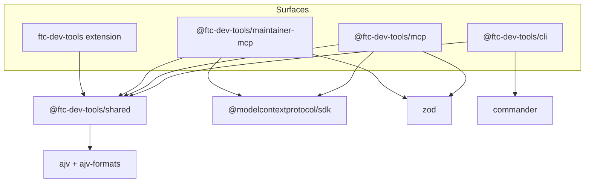
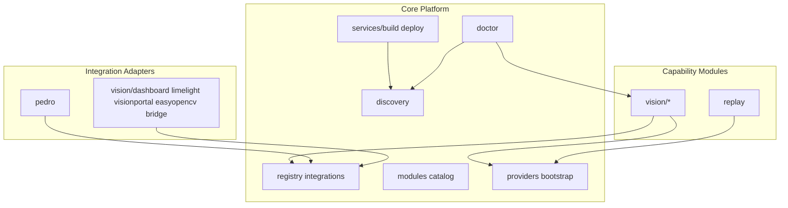

# Repository Inventory

Current inventory of the `ftc-dev-tools` monorepo, mapped to the Orchestrator v2 product taxonomy (ADR-0001). See [coordination-ledger.md](./coordination-ledger.md) for phase status.

**Last updated:** 2026-07-30 — Phase 3 (Vision Lab, Replay foundation) active on `main` / `orchestrator/phase3`.

## Summary

FTC Dev Tools is a **five-package** npm workspace with a shared TypeScript core and four surfaces (CLI, VS Code extension, robot MCP, maintainer MCP). Robot code remains Java in user projects; this repository contains **no Java sources**. Phase 2 delivered registries and versioned schemas; Phase 3 shipped Vision Lab foundations and session replay schema/validation.

| Metric                | Phase 1 (stale)          | Current                                                  |
| --------------------- | ------------------------ | -------------------------------------------------------- |
| Packages              | 4                        | **5** (+ `maintainer-mcp`)                               |
| MCP tools (`ftc-mcp`) | 20                       | **59**                                                   |
| JSON schemas          | 2                        | **7**                                                    |
| Integration registry  | Manual only              | **Built-in catalog** (11 integrations)                   |
| Module registry       | Not defined              | **8 module manifests**                                   |
| Provider registries   | Not present              | **5 registries** (frame, vision, telemetry, sim, replay) |
| Vision Lab code       | Planned                  | **Shipped foundation** (`packages/shared/src/vision/`)   |
| Replay                | Partial (VISION-13 only) | **Schema + validation CLI/MCP**; capture deferred        |

## Package map

```text
ftc-dev-tools/
├── packages/
│   ├── shared/              @ftc-dev-tools/shared — core + capability logic
│   ├── cli/                 @ftc-dev-tools/cli — `ftc` executable
│   ├── mcp/                 @ftc-dev-tools/mcp — `ftc-mcp` stdio server
│   ├── maintainer-mcp/      @ftc-dev-tools/maintainer-mcp — maintainer triage MCP
│   └── vscode-extension/    ftc-dev-tools — VS Code / Cursor UI
├── docs/                    VitePress documentation (+ architecture/, samples/)
├── examples/sample-ftc-project   Minimal FTC layout for tests
└── scripts/                 Release, labels, install-deps, MCP smoke tests
```

### npm workspace dependencies



| Package                         | Depends on           | External runtime tools            |
| ------------------------------- | -------------------- | --------------------------------- |
| `@ftc-dev-tools/shared`         | ajv, ajv-formats     | adb, java, gradlew (user project) |
| `@ftc-dev-tools/cli`            | shared, commander    | same                              |
| `@ftc-dev-tools/mcp`            | shared, MCP SDK, zod | same                              |
| `@ftc-dev-tools/maintainer-mcp` | shared, MCP SDK, zod | gh CLI (maintainer workflows)     |
| `ftc-dev-tools` (extension)     | shared (bundled)     | same                              |

All packages remain at npm version **0.1.0**; schema families use independent `schemaVersion` fields per ADR-0005.

---

## Orchestrator taxonomy mapping

### Core Platform (`packages/shared/src/`)

Core folders unchanged from Phase 1 plus registry infrastructure:

| Module          | Responsibility                                                      |
| --------------- | ------------------------------------------------------------------- |
| `adapters/`     | `OfficialFtcProjectAdapter` — project detection and inspection      |
| `config/`       | `.ftc-dev.json` load and validation (incl. `vision` section)        |
| `devices/`      | `AdbDeviceProvider`, `MockDeviceProvider`, selection heuristics     |
| `discovery/`    | Java, ADB, SDK path, FTC CLI discovery                              |
| `doctor/`       | Environment checklist aggregation (+ optional Vision setup section) |
| `errors/`       | Rule-based friendly error interpretation                            |
| `gradle/`       | Wrapper invocation, Java env                                        |
| `hub/`          | Control Hub OS status and update helpers                            |
| `logcat/`       | Log parsing                                                         |
| `modules/`      | **Module registry** — capability/workflow manifests (`catalog.ts`)  |
| `onboarding/`   | Rookie journey, start-here content                                  |
| `paths/`        | OS-specific path helpers                                            |
| `process/`      | `NodeProcessRunner`, sanitization                                   |
| `project/`      | FTC root discovery                                                  |
| `providers/`    | **Provider registries** — frame, vision, telemetry, sim, replay     |
| `readiness/`    | Computer/project/device readiness model                             |
| `registry/`     | **Integration registry** — ecosystem adapter metadata               |
| `robot-config/` | Robot configuration XML parse/validate/pull                         |
| `sdk/`          | FTC SDK check, update, backup                                       |
| `services/`     | Build, deploy orchestration                                         |
| `setup/`        | Computer and project setup plans                                    |
| `types/`        | Shared TypeScript interfaces                                        |
| `wifi/`         | Wi-Fi ADB, routing, hub manage API                                  |
| `hwmap/`        | Hardware map show/codegen                                           |
| `opmode/`       | OpMode list/create templates                                        |
| `feedback/`     | GitHub error reporting                                              |

**Core interfaces** (unchanged contract):

| Interface        | Implementation(s)                         |
| ---------------- | ----------------------------------------- |
| `ProjectAdapter` | `OfficialFtcProjectAdapter`               |
| `DeviceProvider` | `AdbDeviceProvider`, `MockDeviceProvider` |
| `ProcessRunner`  | `NodeProcessRunner`                       |

Surfaces still import shared services directly; registries are read-only catalogs today (ADR-0003/0004).

---

### Integration Adapters

**Registry:** `packages/shared/src/registry/` — 11 built-in integrations in `catalog.ts`. **Behavioral contract:** `IntegrationAdapter` interface defined in ADR-0010 ([#235 ADAPT-01](https://github.com/The-Allsparks/ftc-dev-tools/issues/235); implementation pending).

| Integration id     | Library            | Shipped CLI                   | Capabilities (summary)               |
| ------------------ | ------------------ | ----------------------------- | ------------------------------------ |
| `official-ftc-sdk` | FTC SDK            | — (Core)                      | commands, vision, hardware, logging  |
| `pedro-pathing`    | Pedro Pathing      | `ftc pedro`                   | path-planning, localization, codegen |
| `ftc-dashboard`    | FTC Dashboard      | via `ftc vision dashboard`    | dashboard, logging, replay           |
| `visionportal`     | VisionPortal (SDK) | via `ftc vision visionportal` | vision                               |
| `easyopencv`       | EasyOpenCV         | via `ftc vision easyopencv`   | vision                               |
| `limelight`        | Limelight Vision   | via `ftc vision limelight`    | vision, localization                 |
| `pinpoint`         | GoBilda Pinpoint   | — (Hardware Lab target)       | localization, hardware               |
| `otos`             | SparkFun OTOS      | — (Hardware Lab target)       | localization, hardware               |
| `road-runner`      | Road Runner        | — (legacy/deferred)           | path-planning                        |
| `nextftc`          | NextFTC            | — (experimental eval)         | commands                             |
| `ftclib`           | FTCLib             | — (experimental eval)         | commands, hardware                   |

**Adapter implementations** (code, not just metadata):

| Module                 | Library           | Status                                          |
| ---------------------- | ----------------- | ----------------------------------------------- |
| `pedro/`               | Pedro Pathing     | Shipped — detect, add, scaffold, Gradle patch   |
| `vision/dashboard/`    | FTC Dashboard     | Shipped — status, open, dependency detect       |
| `vision/visionportal/` | VisionPortal      | Shipped — static analysis, scan, status         |
| `vision/easyopencv/`   | EasyOpenCV        | Shipped — static analysis, replay hints         |
| `vision/limelight/`    | Limelight Vision  | Shipped — HTTP status/results, pipeline-as-code |
| `vision/bridge/`       | Diagnostic bridge | Shipped — schema, scaffold Java templates       |

Road Runner, NextFTC, FTCLib, Pinpoint, OTOS are catalog-only until Phase 4 adapter framework.

---

### Capability modules

| Orchestrator module | Registry id    | In-repo status                                                                                  |
| ------------------- | -------------- | ----------------------------------------------------------------------------------------------- |
| **Vision Lab**      | `vision-lab`   | **Shipped foundation** — full `packages/shared/src/vision/` tree, VS Code panel, CLI/MCP        |
| **FTC Replay**      | `ftc-replay`   | **Partial** — `packages/shared/src/replay/` schemas, validation, status; live capture deferred  |
| **FTC Sim**         | `ftc-sim`      | **Descriptor only** — `simulation-registry` placeholder; no runtime adapters                    |
| **Hardware Lab**    | `hardware-lab` | **Partial** — hwmap, robot-config, physical-device-testing docs; localization adapters deferred |
| **Tuning Lab**      | `tuning-lab`   | **Not started** — manifest only (`experimental: true`)                                          |

#### Vision Lab submodule map (`packages/shared/src/vision/`)

| Submodule       | VISION epic  | Responsibility                                  |
| --------------- | ------------ | ----------------------------------------------- |
| `endpoints/`    | VISION-03    | Device/service endpoint discovery               |
| `limelight/`    | VISION-04/05 | HTTP API, pipeline scan/validate/diff           |
| `dashboard/`    | VISION-06    | FTC Dashboard status/open                       |
| `bridge/`       | VISION-07    | Robot-side diagnostic bridge scaffold           |
| `visionportal/` | VISION-08    | VisionPortal static analysis                    |
| `easyopencv/`   | VISION-09    | EasyOpenCV scan, replay hints                   |
| `inspector/`    | VISION-11    | Result inspector types, Limelight normalization |
| `codegen/`      | VISION-12    | Java OpMode/pipeline templates                  |
| `diagnostics/`  | VISION-14    | Aggregated diagnostics, friendly codes          |
| `cli/`          | VISION-15    | Catalog, open targets, JSON envelopes           |
| `mcp/`          | VISION-16    | Agent tool catalog, sanitization                |
| `validation/`   | VISION-17    | Maturity flags, hardware checklists             |

**VS Code Vision Lab:** `packages/vscode-extension/src/vision-lab-*.ts` — activity-bar panel, inspector HTML, replay placeholder UI. Commands: `ftc.openVisionLab`, `ftc.visionRefresh`, `ftc.visionOpenSource`, `ftc.visionCopyInspectorJson`, `ftc.visionCodegen`.

**Deferred Vision Lab:** live video overlay, frame capture, Limelight upload/activate, replay controls in panel (see coordination-ledger).

#### FTC Replay (`packages/shared/src/replay/`)

| Component                                            | Status         |
| ---------------------------------------------------- | -------------- |
| `session.schema.json` / `session-event.schema.json`  | Shipped v1.0.0 |
| Header/event validation, `createSessionHeader`       | Shipped        |
| `getReplayStatus`, capabilities matrix               | Shipped        |
| `replay:session-file` backend descriptor             | Shipped        |
| Live capture, offline replay playback, export bundle | **Deferred**   |

---

### Workflow modules

| Orchestrator module | Registry id         | Status                                                      |
| ------------------- | ------------------- | ----------------------------------------------------------- |
| Autonomous Studio   | `autonomous-studio` | Manifest only (`experimental`, epic #154)                   |
| Match Analysis      | `match-analysis`    | Manifest only (`experimental`, epic #153)                   |
| Driver Practice     | —                   | **Not in module catalog** — backlog only                    |
| Season Support      | —                   | **Not in module catalog** — REQ-RULE-001 in requirements.md |

---

## Surface inventory

### CLI commands (`ftc`)

Registered in `packages/cli/src/index.ts`:

| Top-level command    | Shared domain        | Notes                                             |
| -------------------- | -------------------- | ------------------------------------------------- |
| `doctor`             | doctor               | incl. optional Vision section                     |
| `devices`            | devices              |                                                   |
| `build`              | services/build       |                                                   |
| `deploy`             | services/deploy      |                                                   |
| `logs`               | logcat, devices      |                                                   |
| `clean`              | gradle               |                                                   |
| `sdk` (check/update) | sdk                  |                                                   |
| `wifi`               | wifi                 |                                                   |
| `setup`              | setup, onboarding    |                                                   |
| `install-cli`        | cli-consumer-install |                                                   |
| `hub`                | hub                  |                                                   |
| `pedro`              | pedro                |                                                   |
| `opmode`             | opmode               |                                                   |
| `config`             | robot-config         |                                                   |
| `hwmap`              | hwmap                |                                                   |
| `github`             | feedback             |                                                   |
| **`integrations`**   | registry             | **`list`** — integration catalog                  |
| **`modules`**        | modules              | **`list`** — module manifests                     |
| **`providers`**      | providers            | **`list`** — provider descriptors                 |
| **`vision`**         | vision/*             | See subcommands below                             |
| **`replay`**         | replay               | **`status`**, **`validate`**, **`create-header`** |

#### `ftc vision` subcommands

| Subcommand tree                                             | Purpose                                     |
| ----------------------------------------------------------- | ------------------------------------------- |
| `status`, `discover`, `devices`                             | Config + workspace discovery (VISION-02/03) |
| `diagnostics` / `diagnose`                                  | Aggregated diagnostics (VISION-14)          |
| `catalog`, `open`                                           | CLI catalog and browser open (VISION-15)    |
| `validation status`                                         | Test/maturity report (VISION-17)            |
| `limelight status\|results\|pipelines list\|validate\|diff` | Limelight (VISION-04/05)                    |
| `dashboard status\|open`                                    | FTC Dashboard (VISION-06)                   |
| `bridge status\|scaffold`                                   | Diagnostic bridge (VISION-07)               |
| `visionportal status`                                       | VisionPortal scan (VISION-08)               |
| `easyopencv status`                                         | EasyOpenCV scan (VISION-09)                 |
| `codegen list\|scaffold`, `diagnostic-opmode`               | Java codegen (VISION-12)                    |
| `pipelines list\|validate\|compare`                         | Agent-style shortcuts (VISION-15)           |
| `sessions *`, `capture`                                     | **Deferred** — emit deferred JSON           |

#### `ftc replay` subcommands

| Subcommand               | Purpose                                 |
| ------------------------ | --------------------------------------- |
| `status`                 | Schema versions, capabilities, backends |
| `validate header\|event` | AJV validation against session schemas  |
| `create-header`          | Generate session header JSON            |

---

### MCP tools (`ftc-mcp`)

**59 tools** in `packages/mcp/src/server.ts` (`FTC_MCP_TOOL_NAMES`).

| Category                     | Tools                                                                                                                                                                                                                                                                                                                                                                                      |
| ---------------------------- | ------------------------------------------------------------------------------------------------------------------------------------------------------------------------------------------------------------------------------------------------------------------------------------------------------------------------------------------------------------------------------------------ |
| Core (Phase 1)               | `doctor`, `devices`, `build`, `deploy`, `sdk_check`, `sdk_update`, `wifi_status`, `hub_status`, `hub_update_check`, `pedro_*`, `opmode_*`, `config_*`, `hwmap_*`                                                                                                                                                                                                                           |
| Registry (Phase 2)           | `integrations_list`, `modules_list`, `providers_list`                                                                                                                                                                                                                                                                                                                                      |
| Vision legacy (VISION-02–17) | `vision_status`, `vision_discover`, `vision_devices`, `vision_limelight_*`, `vision_dashboard_*`, `vision_bridge_*`, `vision_visionportal_status`, `vision_easyopencv_status`, `vision_codegen`, `vision_diagnostics`, `vision_validation_status`                                                                                                                                          |
| Vision agent (VISION-16)     | `vision_list_devices`, `vision_get_status`, `vision_get_diagnostics`, `vision_list_pipelines`, `vision_validate_pipeline`, `vision_compare_pipeline`, `vision_list_sessions`, `vision_inspect_session`, `vision_analyze_recording`, `vision_generate_code`, `vision_capture_frame`, `vision_upload_pipeline`, `vision_activate_pipeline`, `vision_upload_python`, `vision_upload_fieldmap` |
| Replay (VISION-13)           | `replay_status`, `replay_validate_header`, `replay_validate_event`, `replay_create_header`                                                                                                                                                                                                                                                                                                 |

Mutations use dry-run + `confirmPlanId`/`confirmPlanHash` gate (`mutation-gate.ts`). Agent vision mutations require explicit `endpointId` (no auto-select).

**Still no MCP tools for:** logs stream, setup/onboarding, hub apply, wifi connect mutations (subset by design).

---

### Maintainer MCP (`ftc-maintainer-mcp`)

Separate package for repo maintainers — **not** part of robot workflow surfaces.

| Tool                                                         | Purpose                  |
| ------------------------------------------------------------ | ------------------------ |
| `issues_open_summary`, `issues_search`, `issue_show`         | Issue triage             |
| `issue_label_check`                                          | Label catalog validation |
| `prs_merged_since`, `open_prs_summary`, `issue_pr_alignment` | PR alignment             |
| `ci_failure_summary`                                         | CI triage                |
| `issue_comment`, `issue_create_preview`                      | Issue authoring          |
| `release_diff`                                               | Release planning         |

Launcher: `scripts/ftc-maintainer-mcp.ps1`. Docs: [maintainer-mcp.md](../maintainer-mcp.md).

---

### VS Code extension commands

60+ commands in `packages/vscode-extension/package.json`. Phase 1 coverage unchanged plus:

| New / Vision-related          | Purpose                       |
| ----------------------------- | ----------------------------- |
| `ftc.openVisionLab`           | Vision Lab activity-bar panel |
| `ftc.visionRefresh`           | Refresh panel data            |
| `ftc.visionOpenSource`        | Navigate to vision source     |
| `ftc.visionCopyInspectorJson` | Copy inspector payload        |
| `ftc.visionCodegen`           | Vision Java codegen wizard    |
| `ftc.openFtcDashboard`        | Open Dashboard in browser     |

Extension shells out to CLI for long-running streams; Vision Lab uses shared vision APIs directly.

---

## Schema inventory

| Schema               | Path                                       | schemaVersion | Purpose                              |
| -------------------- | ------------------------------------------ | ------------- | ------------------------------------ |
| Project config       | `schemas/ftc-dev.schema.json`              | implicit      | `.ftc-dev.json` (+ `vision` section) |
| Doctor report        | `schemas/doctor-report.schema.json`        | implicit      | Structured doctor JSON               |
| Integration manifest | `schemas/integration-manifest.schema.json` | **1.0.0**     | Adapter registry entries             |
| Module manifest      | `schemas/module-manifest.schema.json`      | **1.0.0**     | Capability/workflow modules          |
| Session header       | `schemas/session.schema.json`              | **1.0.0**     | Replay session metadata              |
| Session event        | `schemas/session-event.schema.json`        | **1.0.0**     | Replay event envelope                |
| Vision diagnostic    | `schemas/vision-diagnostic.schema.json`    | **1.0.0**     | Vision diagnostics payload           |

Package exports (ADR-0005): integration, module, session, session-event schemas via `@ftc-dev-tools/shared` subpath exports.

### Gaps vs Orchestrator shared contracts (§9)

| Contract                      | Status                                                         |
| ----------------------------- | -------------------------------------------------------------- |
| Telemetry event schema        | **Partial** — session-event covers envelope; domain events TBD |
| Recording / session header    | **Shipped** v1.0.0                                             |
| Module manifests              | **Shipped** v1.0.0                                             |
| Integration manifests         | **Shipped** v1.0.0                                             |
| Project configuration         | **Partial** — `ftc-dev.schema.json` + vision block             |
| Java schema implementations   | **None** — TypeScript-only repo                                |
| Nanosecond timestamp strategy | **Defined** — ISO-8601 with optional nanos in session schema   |

---

## Internal dependency graph (shared domains)



Capability modules depend on Core APIs and provider descriptors; they do not import each other directly (ADR-0001). Pedro and vision adapters still live as flat folders inside `shared` pending ADR-0006 layout evolution.

---

## Provider registry snapshot

Bootstrapped in `providers/bootstrap.ts` (descriptor-only; no live streaming):

| Registry            | Count | Examples                                                                                              |
| ------------------- | ----- | ----------------------------------------------------------------------------------------------------- |
| Frame providers     | 5     | `frame:visionportal`, `frame:limelight`, `frame:easyopencv`, `frame:sim-virtual`, `frame:replay-file` |
| Vision providers    | 4     | `vision:visionportal`, `vision:limelight`, `vision:easyopencv`, `vision:sim-virtual`                  |
| Telemetry providers | 2     | `telemetry:logcat`, `telemetry:ftc-dashboard`                                                         |
| Simulation runtimes | 1     | `sim:adapter-placeholder`                                                                             |
| Replay backends     | 1     | `replay:session-file`                                                                                 |

---

## Gap matrix (Orchestrator §19 completion criteria)

Criteria carried forward from Phase 1 inventory, updated for current state:

| Criterion                         | Phase 1 (stale)     | Current                                                                   | Severity                | Target                      |
| --------------------------------- | ------------------- | ------------------------------------------------------------------------- | ----------------------- | --------------------------- |
| Module architecture implemented   | Flat shared folders | Registries + manifests; **still flat folders**                            | Medium                  | Phase 4–6 (ADR-0006)        |
| Ecosystem documented              | Not present         | **Shipped** — `ftc-software-ecosystem.md`                                 | OK                      | Maintain                    |
| Integration registry              | Manual registration | **Built-in catalog**; CLI/MCP still manual tool wiring                    | Medium                  | Phase 4 adapter framework   |
| Capability matrix                 | Not present         | **Shipped** — `library-capability-matrix.md`                              | OK                      | Maintain                    |
| Java/TS boundary enforced         | Principles only     | **ADR-0002** + schemas; no Java CI                                        | Medium                  | Phase 6                     |
| Public APIs versioned             | Single 0.1.0        | Still **0.1.0** monolith                                                  | Low                     | Phase 6                     |
| Schemas versioned                 | 2 project schemas   | **7 schemas**, independent `schemaVersion`                                | OK                      | Expand with telemetry       |
| Replay/Sim/Vision via providers   | Not implemented     | **Vision shipped**; providers **descriptor-only**; replay validation only | Medium                  | Phase 3 finish + Phase 4    |
| Issues and epics aligned          | Partial             | **Phase 3 ledger** tracks VISION-01–18                                    | OK                      | Hardware validation pending |
| Documentation updated             | Phase 1 docs        | **Vision Lab docs** + architecture set                                    | In progress             | Screenshots, Phase 6        |
| Tests passing                     | CI green            | CI green + vision/replay test suite                                       | OK                      | Maintain                    |
| Java CI / cross-schema validation | Absent              | **Still absent**                                                          | Medium                  | Phase 6                     |
| Live replay capture               | —                   | **Deferred**                                                              | Blocker for Replay epic | Phase 3+                    |
| Sim runtime adapters              | —                   | **Placeholder only**                                                      | Blocker for Sim epic    | Phase 4                     |
| Workflow modules                  | Not started         | **Manifests only** (2 of 4)                                               | Low                     | Phase 5                     |
| Physical hardware validation      | —                   | **Pending** checklists                                                    | Medium                  | VISION-17 follow-up         |

---

## Scripts and examples

### `scripts/`

| Script                                                  | Purpose                       |
| ------------------------------------------------------- | ----------------------------- |
| `install-deps-{windows,macos,linux}.*`                  | JDK + Android cmdline tools   |
| `issue-labels.mjs`, `issue-label-catalog.json`          | Label taxonomy                |
| `issue-close-guard*.mjs`                                | Issue close policy            |
| `release-check.mjs`, `bump-version.mjs`                 | Release hygiene               |
| `mcp-readonly-smoke.mjs`                                | MCP read-only tool smoke test |
| `ftc-maintainer-mcp.ps1`                                | Maintainer MCP launcher       |
| `create-parity-issues.mjs`, `pr-merge-close-issues.mjs` | Automation                    |

### `examples/sample-ftc-project/`

Minimal Gradle FTC layout for unit/integration tests — not a full SDK clone. Referenced by REQ-PROJ-001 as scaffold baseline.

### `docs/samples/`

| Sample              | Purpose                                      |
| ------------------- | -------------------------------------------- |
| `vision-session/`   | Session header + events JSONL example        |
| `vision-workspace/` | Limelight pipeline + `.ftc-dev.json.example` |

---

## Relationship to existing docs

| Document                                                       | Relationship                                                       |
| -------------------------------------------------------------- | ------------------------------------------------------------------ |
| [coordination-ledger.md](./coordination-ledger.md)             | Phase 1–2 complete; Phase 3 active deliverable tracker             |
| [architecture.md](../architecture.md)                          | Shipped behavior reference; partially superseded by ADRs           |
| [vision-lab.md](../vision-lab.md)                              | Vision Lab user guide (VISION-18)                                  |
| [vision-architecture.md](../vision-architecture.md)            | Vision system overview                                             |
| [architecture/vision-providers.md](./vision-providers.md)      | Provider model (VISION-01)                                         |
| [architecture/replay-session.md](./replay-session.md)          | Session recording design                                           |
| [ftc-software-ecosystem.md](./ftc-software-ecosystem.md)       | Ecosystem map (Phase 2)                                            |
| [library-capability-matrix.md](./library-capability-matrix.md) | Adapter capability matrix (Phase 2)                                |
| [feature-maturity.md](../feature-maturity.md)                  | Mock vs hardware validation per feature                            |
| [parity-audit.md](../parity-audit.md)                          | Gap vs Android Studio / FTC for VS Code                            |
| [requirements.md](../requirements.md)                          | Formal REQ-* requirements (project create, debugger, season rules) |
| [maintainer-mcp.md](../maintainer-mcp.md)                      | Fifth package documentation                                        |
| [adr/](./adr/)                                                 | ADR-0001 through ADR-0006                                          |

---

## Changes since Phase 1 inventory (2026-07-30)

1. **Fifth package:** `@ftc-dev-tools/maintainer-mcp` for GitHub/CI triage (11 tools).
2. **Registries shipped:** integration (`registry/`), module (`modules/`), provider (`providers/`) with CLI `list` and MCP `*_list` tools.
3. **Vision Lab:** ~12 submodules under `vision/`, VS Code panel, 38+ MCP vision tools, extensive `ftc vision` CLI tree.
4. **Replay foundation:** session schemas, validation CLI/MCP; capture/playback still deferred.
5. **Schemas:** 2 → 7; versioned manifest and session families per ADR-0005.
6. **Integration catalog:** 11 entries including vision, pathing, localization libraries.
7. **Module catalog:** 8 manifests (core + 5 capability + 2 workflow); Driver Practice and Season Support not yet registered.
8. **Documentation:** ecosystem, capability matrix, vision architecture set, samples, maintainer MCP guide.
9. **Phase status:** Phase 1–2 complete; Phase 3 active per coordination ledger.
10. **Still unchanged:** npm 0.1.0, flat `shared/` layout, no Java sources, manual MCP/CLI registration wiring, no live frame streaming.

---

## Assumptions

- Inventory reflects workspace at Phase 3 branch point (`orchestrator/phase3` / current `main` merge state).
- Provider catalog entries are **descriptors** for discovery; runtime frame/telemetry streaming is not implemented.
- Vision agent MCP mutation tools (`vision_upload_*`, `vision_capture_frame`) may return deferred payloads until hardware validation completes.
- Session schema covers header + event envelope; domain-specific replay events are a follow-up Replay epic task.
- Orchestrator suggested physical layout (`integrations/`, `workflows/`, `robot/` packages) remains deferred to ADR-0006 incremental evolution.
- Maintainer MCP is out-of-band from robot product surfaces and not required for team robot workflows.
