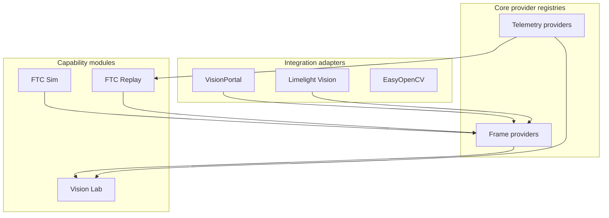

# Vision provider architecture

Phase 3 foundation for **VISION-01**. Implements [ADR-0004](./adr/0004-provider-based-composition.md): Vision Lab consumes cameras through the frame provider registry, not direct Sim or Replay imports.

## Layers



## Provider types

| Registry   | Purpose                               | Example ids                                                  |
| ---------- | ------------------------------------- | ------------------------------------------------------------ |
| Frame      | Raw camera / image streams            | `frame:visionportal`, `frame:limelight`, `frame:sim-virtual` |
| Vision     | Vision-specific metadata + frame link | `vision:visionportal`, `vision:limelight`                    |
| Telemetry  | Metrics and structured robot data     | `telemetry:logcat`, `telemetry:ftc-dashboard`                |
| Simulation | Pluggable sim runtimes                | `sim:adapter-placeholder`                                    |
| Replay     | Session backends                      | `replay:session-file`                                        |

Vision providers reference a **frame provider id** instead of importing Sim or Replay modules.

## Code locations

| Path                                          | Role                           |
| --------------------------------------------- | ------------------------------ |
| `packages/shared/src/providers/types.ts`      | Provider descriptor interfaces |
| `packages/shared/src/providers/*-registry.ts` | Register / list / get by id    |
| `packages/shared/src/providers/bootstrap.ts`  | Built-in catalog seeds         |
| `packages/shared/schemas/session.schema.json` | Replay session header (v1.0.0) |

## Surfaces

```bash
ftc modules list --json      # capability module manifests
ftc providers list --json    # provider registry snapshot
ftc vision discover --json   # scan TeamCode / Gradle for vision signals
ftc vision status --json     # config + discovery combined
ftc vision devices --json    # endpoint discovery + network probes
ftc vision limelight status --json   # Limelight Vision HTTP /status
ftc vision limelight results --json  # normalized /results targeting
```

MCP: `modules_list`, `providers_list`, `vision_status`, `vision_discover`, `vision_devices`, `vision_limelight_status`, `vision_limelight_results` (read-only).

## Limelight Vision provider (VISION-04)

Read-only HTTP integration on port **5807** (`/status`, `/results`). Pipeline switching, snapshots, and other POST mutations remain gated for a follow-up with explicit confirmation.

Host resolution order: `--host` → `vision.limelight.host` → discovered API endpoint. Multiple matches require explicit `--host`.

## Pipeline-as-code (VISION-05)

Version-control Limelight Vision pipelines under `vision.pipelineDirectory` or `vision.limelight.pipelineDirectory`:

```bash
ftc vision limelight pipelines list --json
ftc vision limelight pipelines validate --json
ftc vision limelight pipelines diff --slot 0 --json
```

Upload, activation, and rollback are separate follow-up work (capabilities flag them unsupported).

## Next steps (VISION-06+)

- Live frame acquisition for VisionPortal
- Vision Lab IDE panel consuming `listVisionProviders()`

## Related

- [Vision Lab epic](https://github.com/The-Allsparks/ftc-dev-tools/issues/48)
- [FTC Replay epic](https://github.com/The-Allsparks/ftc-dev-tools/issues/143)
- [Library capability matrix](./library-capability-matrix.md)
